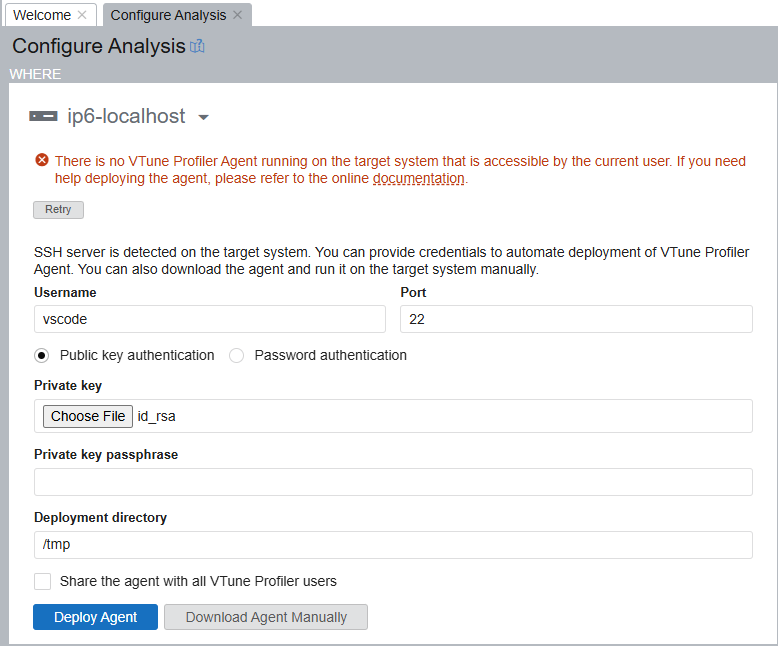

# GPU Pattern Match Stub (Ubuntu 22.04, clang, CMake, Ninja, mold, OpenCL, Intel Arc)

This repo is a minimal, reproducible scaffold:
- CSR-only tree representation
- bottom-up pattern matching stub
- OpenCL smoke test (verifies GPU execution path)

## Educational materials

1. [Run HPC Applications on CPUs & GPUs with Xe Architecture Using Intel® C++ & Intel® Fortran Compilers with OpenMP*
by Xianmin Tian](https://www.intel.com/content/www/us/en/developer/videos/run-hpc-apps-intel-c-fortran-compilers-with-openmp.html): video and slides unavailable elsewhere

# Prerequisities

## Host requirements (important for Intel Arc A770)
The Intel kernel driver and `/dev/dri` live on the host, not inside Docker.
To access the GPU from the container you must pass `/dev/dri` through.

## Build the Docker image
From this directory:

```bash
cd docker && docker build -t arc-opencl-dev .
```

## Run the container (with GPU access)

44 = `video` group
110 = `render` group

```
cd gpu && docker run -d \
  --user=vscode
  --name arc-opencl-dev \
  --device=/dev/dri \
  --group-add 110 \
  --group-add 44 \
  -v "$(pwd)":/workspace \
  --workdir /workspace \
  --restart unless-stopped \
  arc-opencl-dev \
  sleep infinity
```

Inside the container, check OpenCL visibility:

```
clinfo | sed -n '1,120p'
```

You should see an Intel platform/device. If not, it's usually a host permission issue
(you may need your host user in the render group).

# Build

## Release

```
/workspace$ mkdir -p build/Release
/workspace$ cd build/Release
/workspace/build/Release$ cmake ../.. -DCMAKE_BUILD_TYPE=Release
/workspace/build/Release$ cmake --build . -j 8
```

Run:

```
$ ./stub
```

## Debug

Debugging prerequisities: 
 1. https://www.intel.com/content/www/us/en/docs/distribution-for-gdb/get-started-guide-linux/2025-2/overview.html
 2. https://dgpu-docs.intel.com/driver/installation.html

```
/workspace$ mkdir -p build/Debug
/workspace$ cd build/Debug
/workspace/build/Debug$ cmake ../.. -DCMAKE_BUILD_TYPE=Debug
/workspace/build/Debug$ cmake --build . -j 8
```

Run:

```
$ gdb-oneapi ./stub
```

## VSCode IntelliSense

 1. make sure you used `CMAKE_EXPORT_COMPILE_COMMANDS=1`
 2. disable MS C++ extensions's IntelliSense, ie. in .vscode/settings.json put `"C_Cpp.intelliSenseEngine": "disabled"`
 3. make sure that the path set in the `.clangd` file points to the correct `compile_commands.json`

# Run

## Quick Python test

Please note: build the C code in Release mode (refer to the [Release build](#release) section).

```
/workspace$ PYTHONPATH=`realpath ./bindings/python/src/` python3 test.py
```

## Debug C in a Python script

Please note: build the C code first in Debug mode (refer to the [Debug build](#debug) section).

```
/workspace$ PYTHONPATH=`realpath ./bindings/python/src/` gdb-oneapi python3
(gdb) set args test.py
(gdb) b src/algorithms.cpp:11
No symbol table is loaded.  Use the "file" command.
Make breakpoint pending on future shared library load? (y or [n]) y
Breakpoint 1 (src/algorithms.cpp:11) pending.
(gdb) r
Starting program: /usr/bin/python3 test.py
```

# vtune

### On the host

See:
 - https://www.intel.com/content/www/us/en/docs/vtune-profiler/user-guide/2023-2/set-up-system-for-gpu-analysis.html

#### Enable hardware profiling on Arc A770 (needed after each reboot):

```
sudo sysctl -w dev.i915.perf_stream_paranoid=0
```

#### Build the Docker image

```
cd docker && docker build -t arc-opencl-dev -f Dockerfile . && cd -
```

#### Run the Docker image

```
docker run -it --name arc-opencl-dev   --device=/dev/dri    --group-add 44   -v "$(pwd)":/workspace   --workdir /workspace --user vscode   arc-opencl-dev bash
```

## Inside Docker

##### Test VTune

```
/workspace $ vtune -c gpu-offload ./test.py
```

#### Set up VTune Agent

See [VTune agent set-up documentation](https://www.intel.com/content/www/us/en/docs/vtune-profiler/user-guide/2025-1/deploy-vtune-profiler-agent.html).

##### Start sshd

```
$ sudo /usr/sbin/sshd
```

##### VTune Agent

user name: `vscode`
private key: `docker/dummy_keys/id_rsa`


